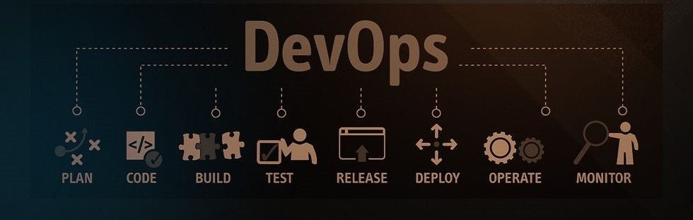

  

## 
Olá, Mundo!👋 Eu sou Bruno Sousa

#### 

###
DevOps Engineer | Docker | Linux | Jenkins | AWS | Git | Terraform | Ansible | Kubernetes | Technical Blogger

- **Linkedln**: [https://www.linkedin.com/in/bruno-sousa-6759a527/]
- **Email**: [bmsousa1991@gmail.com](mailto:bmsousa1991@gmail.com)
- **Blog**: *[Em Construção]*

## Projetos

🚀 Estou construindo o [**DevOpsBrHub**](https://github.com/DevOpsBrHub), um hub central para aprendizado e prática de **DevOps**.  
🏗️ Abaixo estão meus repositórios em destaque (em construção):  

➡️ [**AWSHub**](https://github.com/DevOpsBrHub/AWSHub): 📚 Coleção de documentação e recursos de aprendizado sobre serviços e certificações **AWS**.

  

